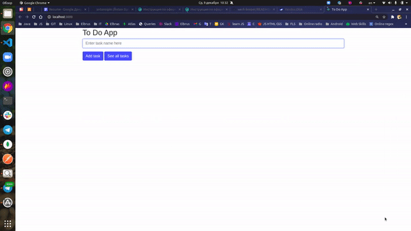
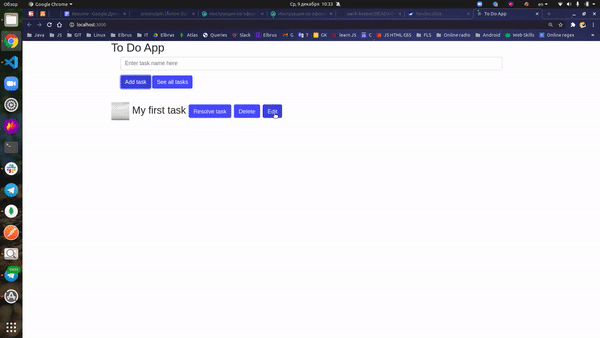
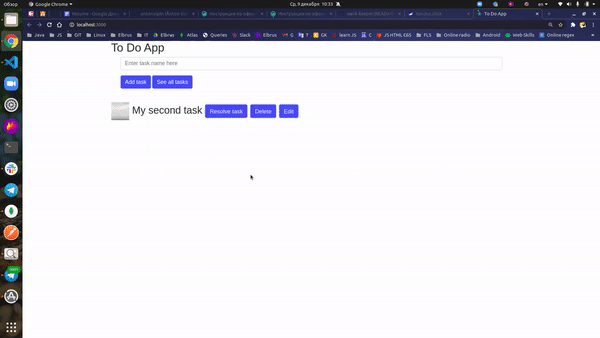
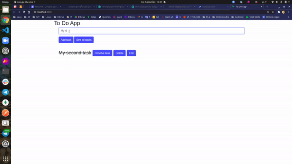
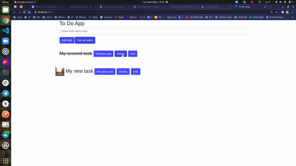

# ToDo List

<h3> This is animated interactive application for adding, editing and storing a to-do list.
</h3>
    
  <h3>
    Techs: HTML, CSS, JavaScript, Express.js, Node.js, MongoDB, React, Redux-Thunk, React Bootstrap, React-animations, REST API.
   </h3>
   
 <h3>
    The app is available on Heroku: https://interactive-to-do-list.herokuapp.com
   </h3>
   
  <h3>
   How to start the app locally:
    
   </h3>
   
  

  <ul>
    <li>
      Clone this repo <b><i> git clone git@github.com:antonsipin/ToDoList.git</i></b>
    </li>
     <li>
       Go to the backend folder <b><i> cd backend </i></b>
    </li>
    <li>
      Install the dependencies <b><i> npm install </i></b>
    </li>
    <li>
      Place the <b>.env</b> file in the root directory (you can get it from me or take a look at <b>.envexample</b> file)
    </li>
    <li>
      Run the app server <b><i> npm start </i></b> (The server starts at http://localhost:3100)
    </li>
    <li>
      Go to the frontend folder <b><i> cd frontend </i></b>
    </li>
    <li>
      Install the dependencies <b><i> npm install </i></b>
    </li>
    <li>
      Run the app <b><i> npm start </i></b> (The app starts at http://localhost:3000 in browser and you will be able to test the app)
    </li>
  </ul>
  

  
  <h3 align="center">
  
Adding a task in the database:
 
   
  
Editing a task in the database:
 
   
  
Editing a task in the database:
 
   
  
Query and display tasks from the database:
 
   
  
Removing a task from the database:
 
  
  </h3>
